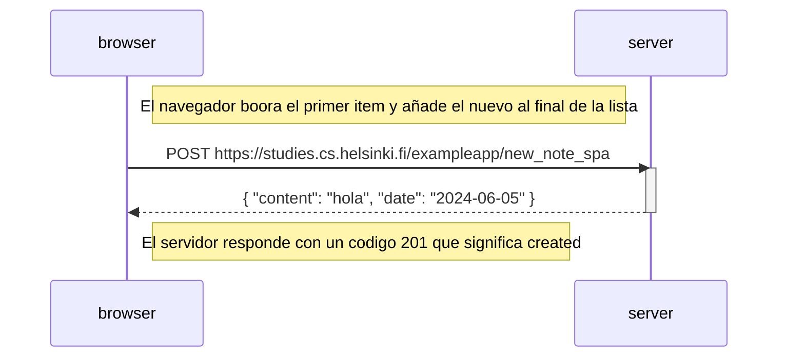

```mermaid
sequenceDiagram
    participant browser
    participant server

    Note right of browser: El navegador boora el primer item y añade el nuevo al final de la lista 

    browser->>server: POST https://studies.cs.helsinki.fi/exampleapp/new_note_spa
    activate server
    server-->>browser: { "content": "hola", "date": "2024-06-05" }
    deactivate server

    Note right of browser: El servidor responde con un codigo 201 que significa created
    

```